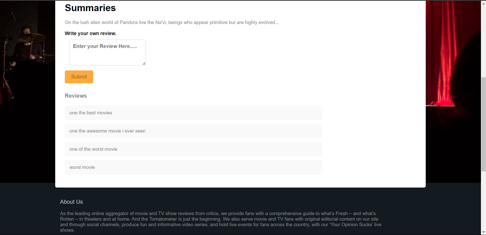
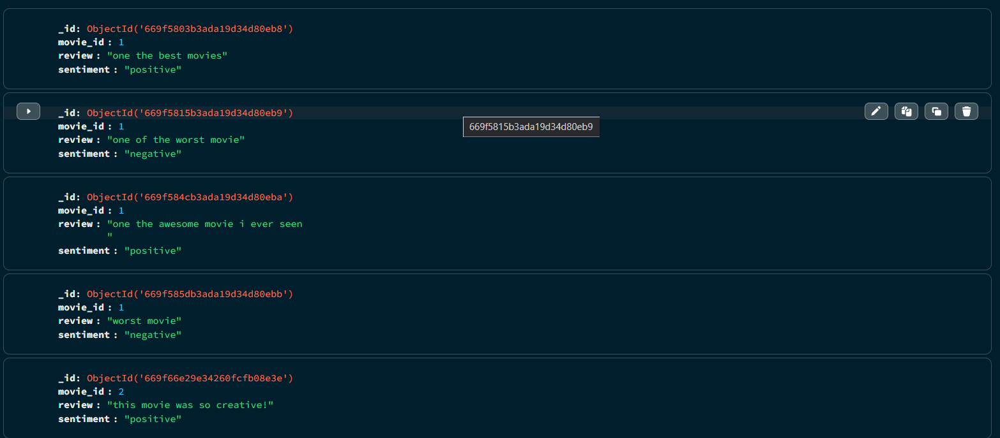

# [Movie Review 2.0](https://sasuke-uchiha12.github.io/Movie-Review-2.o/)

Welcome to the Movie Review 2.0 project! This project is a web application for reviewing movies, featuring sentiment analysis on user comments and reviews.

#### You can view the live project [here](https://sasuke-uchiha12.github.io/Movie-Review-2.o/)

## Table of Contents

- [Introduction](#introduction)
- [Features](#features)
- [Setup](#setup)
- [Running the Project](#running-the-project)
- [Sentiment Analysis](#sentiment-analysis)
- [Screenshots](#screenshots)
- [Technologies Used](#technologies-used)
- [License](#license)

## Introduction

Movie Review 2.0 is a web application where users can read and write reviews for movies. The application includes sentiment analysis that sorts reviews from good to bad based on user comments. 

## Features

- Review and comment on movies
- Sentiment analysis on reviews and comments
- Responsive design for mobile and desktop
- Dynamic routing and 404 error handling

## Setup

### Prerequisites

- Node.js (v14 or above)
- npm (v6 or above)
- Python (v3.7 or above)

### Installation

1. Clone the repository:
    ```bash
    git clone https://github.com/sasuke-uchiha12/Movie-Review-2.o.git
    ```

2. Navigate to the project directory:
    ```bash
    cd Movie-Review-2.o
    ```

3. Install frontend dependencies:
    ```bash
    cd frontend
    npm install
    ```

4. Install backend dependencies:
    ```bash
    cd backend
    pip install Flask pymongo textblob flask-cors   
    ```

## Running the Project

### Frontend

To start the frontend development server, run:

```bash
cd frontend
npm start
```
### Backend

To start the backend development server, run:

```bash
cd backend
python app.py
```

## Sentiment Analysis
The sentiment analysis feature in this project processes user comments and reviews to determine their sentiment, sorting reviews from good to bad. This is achieved using the TextBlob library in Python. The backend Flask server handles the sentiment analysis and returns the sentiment score to the frontend, which then dynamically sorts the reviews.

## Screenshots


Sorting reviews from good to bad


Backend side


## Technologies Used
- React, React Router, Sass
- Python, Flask
- MongoBD
- GitHub Pages
- TextBlob for sentiment analysis
